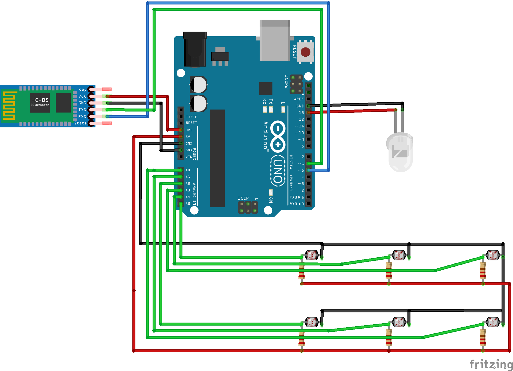

# A smart, connected mailbox

**Why going every day in front of the mailbox, when you could have a smart mailbox that notifies you when there's mail ?**


## The concept

The idea is to be able to know if there is something in the mailbox, without complex or expensive materials, nor taking too much space. 

The system is as follows :
- A LED is located on the inside top of the mailbox, facing down. 
- On the floor of the mailbox is a set of photosensors facing up.

All the photosensors (aka photoresistors) are connected to an Arduino, and give a voltage response based on the light they receive. Using the Arduino's on-board analog to digital converter, we can map this response, from 0 (no light) to 1024 (peak brightness of the sensor).

To check if there is mail, we light up the LED on the top then check all the sensors. If the sensors responses are above 0, none of the sensors are blocked.

But if one of them replies 0, it means the sensor is "blocked" from the LED's light, by a letter or package..

To communicate, the Arduino uses a bluetooth connexion, via a HC-05 module. On the other end, you can use any device capable of initiating a Bluetooth connection (like a raspberry pi).


## Hardware

- 1 White 5V LED
- 6 photosensors
- 6 470 Ohm resistors
- 1 Arduino (Uno or even Nano for size's sake)
- 1 HC-05 bluetooth module
- some cables

Below is a schematic of the embedded part : 



Every photosensor is connected to an analog pin on the arduino.

## Embedded part

The embedded code relies on the `SoftwareSerial` [library](https://www.arduino.cc/en/Reference/SoftwareSerial) to communicate with the bluetooth dongle.

Once installed, just compile and upload the `.ino` file on the arduino.

## Server

To interface the embedded system, a python script that runs on a nearby device (like a Raspberry Pi) connects to the arduino using its Bluetooth address, and retrieve the status of each sensor. 

To be able to connect to the arduino via Bluetooth, you will need to pair it before, here using bluetoothctl: 

```bash
bluetoothctl
> power on
> default-agent
> scan on
> trust XX:XX (MAC addr of the HC:05)
> pair XX:XX (MAC addr of the HC:05)
> Enter PIN : 1234 (The actual pin code is 1234)
> quit
```

The MAC address of the dongle must be added in the python script :

```python
arduino = "Your Arduino MAC address here"
```

You can customize the script to do whatever you desire when there is mail : 

```python
if results.count(1) is 5:
        # There is mail, do stuff !

        # Uncomment for twitter integration
        # twitter_notify()
        pass
    else:
        # No mail
        pass
```

To have the milbox fetched automatically, you can add a new entry in cron, like so :

`*/10 * * * * python path/to/mailbox_fetch.py`

## Twitter integration

If you want your mailbox to be twitter-enabled, you will need a few things : 

- a separate twitter account for the mailbox, with dev mode enabled and an app setup (PITA to setup, follow [this guide](https://python-twitter.readthedocs.io/en/latest/getting_started.html))
- the id of your own twitter account, which you can get from [here](https://tweeterid.com)
- the package, via `pip install python-twitter`

In the python script, just setup the following variables, according to your twitter Dev app keys and tokens : 

```python
twitter_id="<Your twitter ID>"
api = twitter.Api(consumer_key="",
                  consumer_secret="",
                  access_token_key="",
                  access_token_secret="")
```

## License

MIT